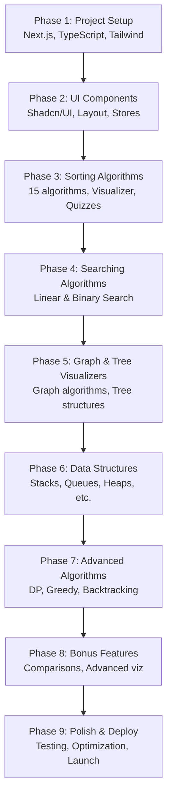

# Algorise - Interactive Algorithm Mastery Platform

Visualize, Learn, Master Algorithms.

Algorise is a production-grade, portfolio-quality Interactive Algorithm Visualizer web application.

## Features
- **Interactive Visualizations:** Canvas and D3.js based animations for sorting, searching, graphs, trees, and more.
- **Step-by-step Explanations:** Understand algorithms with clear, plain English explanations at every step.
- **Code Highlights:** See exactly which line of code is executing in Python, JavaScript, and C++.
- **Compare Algorithms:** Run two algorithms side-by-side to understand performance differences.
- **Test Your Knowledge:** Built-in quizzes to reinforce learning.

## Tech Stack
- Next.js 14 (App Router)
- TypeScript (Strict Mode)
- Tailwind CSS & Shadcn/UI
- Zustand (State Management)
- GSAP & Framer Motion (Animations)
- Monaco Editor (Code Views)
- D3.js & Canvas API (Visualizations)

## Project Roadmap



## Current Status

### Completed Phases:
- **Phase 1:** Initialized Next.js 14 App Router project with TypeScript and Tailwind CSS. Configured absolute imports, Prettier, and ESLint.
- **Phase 2:** Installed and setup Shadcn/UI components (Buttons, Sliders, Tabs, Tooltips, Toasts/Sonner). Setup Zustand stores (`visualizationStore.ts`, `dataStore.ts`, `uiStore.ts`). Built Layout components (`Sidebar.tsx`, `Navbar.tsx`, `ThemeToggle.tsx`, `ThemeProvider.tsx`). Configured initial layout and basic routing structure.
- **Phase 3:** Built the `ArrayVisualizer.tsx` using Canvas API. Created the GSAP timeline controller hook (`useVisualization.ts`). Implemented UI Controls: `PlaybackControls.tsx`, `SpeedSlider.tsx`, `ArrayInput.tsx`. Built the `StepExplanation.tsx` and `ComplexityBadge.tsx` panels. Implemented all 15 sorting algorithms with metadata, 3 languages, and 5 quizzes each. Added `CodePanel.tsx` (Monaco) and `QuizModal.tsx`.
- **Phase 4:** Added `SearchTargetInput.tsx` for dynamic search goals. Implemented Linear Search and Binary Search algorithms. Created dynamic searching page `[slug]/page.tsx`.

### Upcoming Phases:
- **Phase 5:** Graph & Tree Visualizers
- **Phase 6:** Data Structures
- **Phase 7:** Dynamic Programming & Greedy
- **Phase 8:** Bonus Features
- **Phase 9:** Polish

## Running Locally
```bash
npm install
npm run dev
```
